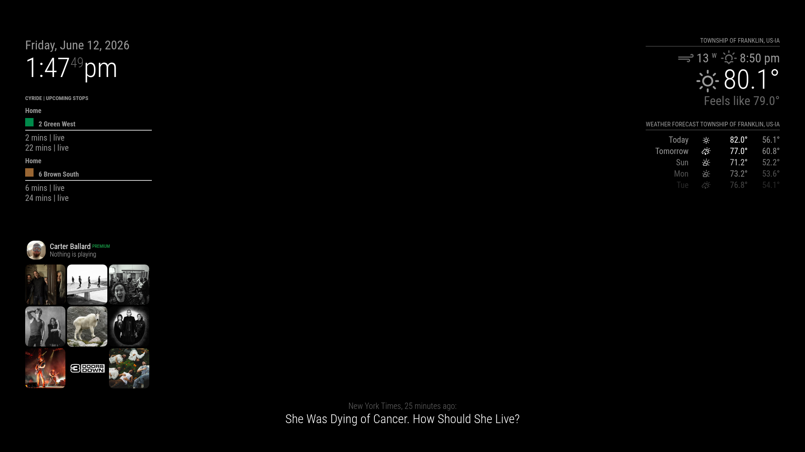
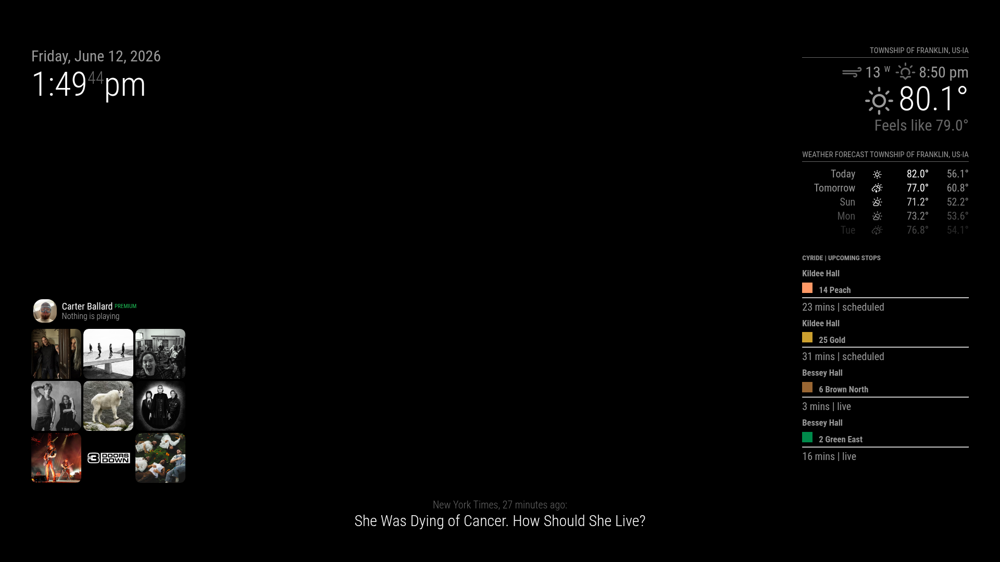
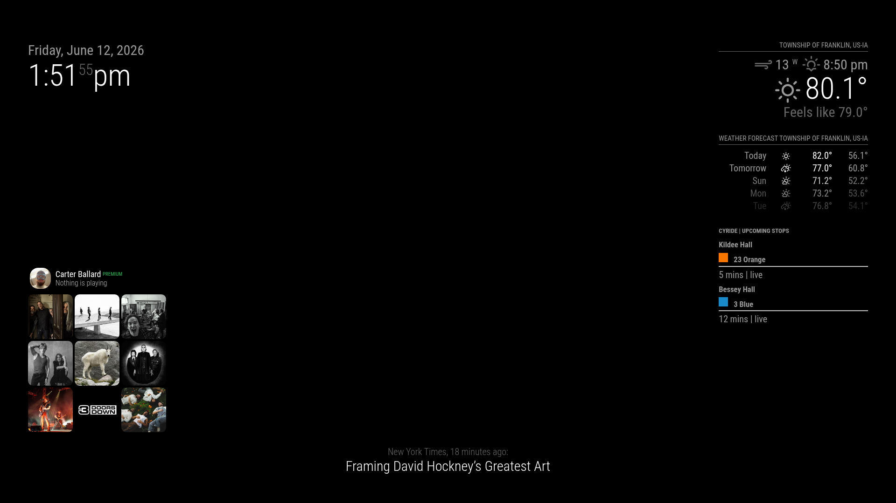
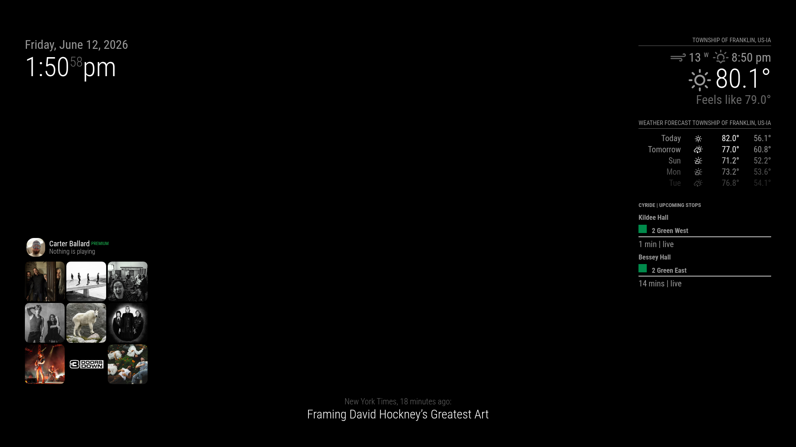

# MMM-CyRide

A [Magic Mirror](https://github.com/MichMich/MagicMirror) module to show upcoming CyRide routes near your location. CyRide is the public bussing system in Ames, IA home of Iowa State University. Go Cyclones!

## Installation

To install MMM-CyRide, open the modules folder of your `MagicMirror` installation. Run the following commands:

- `git clone https://github.com/patrickdemers6/MMM-CyRide.git`
- `cd MMM-CyRide`
- `npm install`

This module uses `node-fetch@2` in `node_helper.js` to request CyRide arrival data.

To finish adding the module, follow the configuration settings below.

## Configuration

Add the following code to your Magic Mirror's `config.js` file's `modules` array.

```js
{
  module: "MMM-CyRide",
  position: "top_left", // customize to the position you want
  config: {
    stops: [
      { stopID: "2501", label: "Home" },
      { stopID: "2520", label: "Campus" }
    ],
    customerID: "187"
  }
}
```

For a single stop, the older `stopID` config style is still supported:

```js
{
  module: "MMM-CyRide",
  position: "top_left",
  config: {
    stopID: "2501",
    stopLabel: "Home",
    customerID: "187"
  }
}
```

### Configuration Options

| Option | Default | Description |
| --- | --- | --- |
| `stops` | `undefined` | Preferred multi-stop config. Each stop should include `stopID` and can include a display `label`. |
| `stopID` | `"5108903"` | Legacy single-stop CyRide RTPI stop number. Used when `stops` is not configured. |
| `stopLabel` | `"Stop {stopID}"` | Optional label for the legacy single-stop config. |
| `customerID` | `"187"` | MyCyRide customer ID. Kept configurable for compatibility with the MyCyRide API. |
| `rotationInterval` | `5000` | Milliseconds each page of routes stays visible before rotating. |
| `maxArrivalsPerRoute` | `2` | Number of arrival times to show under each route. |
| `maxRoutesPerPage` | `2` | Number of route blocks to show before rotating to the next page. |
| `routePageMode` | `"combined"` | Controls route paging. Use `"combined"` to page all stops together or `"perStop"` to show routes from each stop on the same page. |
| `maxRoutesPerStopPerPage` | `1` | In `"perStop"` mode, number of route blocks to show for each stop before rotating. |
| `hideRoutes` | `[]` | Hide routes using case-insensitive partial matches against the displayed route name. |

### Example Configs

#### Single Stop

Use this when you only care about one stop.

```js
{
  module: "MMM-CyRide",
  position: "top_left",
  config: {
    stopID: "2501",
    stopLabel: "Home",
    customerID: "187"
  }
}
```

#### Compact Multi-Stop Display

Use this when you want several stops on screen but only the next arrival for each route.

```js
{
  module: "MMM-CyRide",
  position: "top_right",
  config: {
    stops: [
      { stopID: "2501", label: "Kildee Hall" },
      { stopID: "2520", label: "Bessey Hall" }
    ],
    customerID: "187",
    maxArrivalsPerRoute: 1,
    maxRoutesPerPage: 4,
    rotationInterval: 10000
  }
}
```

#### Focus On Specific Routes

Use this when a stop has many routes but you only want to see matching routes. Route filters are case-insensitive and can match part of the displayed route name.

```js
{
  module: "MMM-CyRide",
  position: "top_right",
  config: {
    stops: [
      { stopID: "2501", label: "Kildee Hall" },
      { stopID: "2520", label: "Bessey Hall" }
    ],
    customerID: "187",
    showOnlyRoutes: ["green"],
    maxArrivalsPerRoute: 1,
    maxRoutesPerPage: 6
  }
}
```

#### Balanced Multi-Stop Paging

Use this when you want each page to show routes from each configured stop instead of paging through one combined route list.

```js
{
  module: "MMM-CyRide",
  position: "top_right",
  config: {
    stops: [
      { stopID: "2501", label: "Kildee Hall" },
      { stopID: "2520", label: "Bessey Hall" }
    ],
    customerID: "187",
    routePageMode: "perStop",
    maxRoutesPerStopPerPage: 1,
    maxArrivalsPerRoute: 1,
    rotationInterval: 8000
  }
}
```

## Screenshots

### Single Stop



### Compact Multi-Stop Display



### Route Filtered Display



### Balanced Per-Stop Paging



### Route Paging

By default, `routePageMode` is `"combined"`. This treats every stop and route pair as one combined list, then uses `maxRoutesPerPage` to decide how many route blocks appear at once.

```js
config: {
  stops: [
    { stopID: "2501", label: "Kildee Hall" },
    { stopID: "2520", label: "Bessey Hall" }
  ],
  routePageMode: "combined",
  maxRoutesPerPage: 2
}
```

If one stop has several routes, `"combined"` mode may show multiple routes from that same stop before rotating to routes from another stop.

Use `"perStop"` mode when you want each page to include routes from each configured stop:

```js
config: {
  stops: [
    { stopID: "2501", label: "Kildee Hall" },
    { stopID: "2520", label: "Bessey Hall" }
  ],
  routePageMode: "perStop",
  maxRoutesPerStopPerPage: 1
}
```

With this setup, each page shows up to one route from Kildee Hall and one route from Bessey Hall before rotating.

### Route Filtering

Use `hideRoutes` to remove routes from the display. Filters are case-insensitive and can match part of the displayed route name.

```js
config: {
  stops: [
    { stopID: "2501", label: "Home" }
  ],
  hideRoutes: ["green"]
}
```

This hides routes such as `2 Green West`.

Use more specific filters when needed:

```js
hideRoutes: ["2 Green West"]
```

Avoid overly broad filters like `"2"` unless you intentionally want to match any route name containing `2`, such as `12 Lilac` or `21 Cardinal`.

### Find your Stop ID
To find your stop's ID, use this website [on this website](https://mycyride.com/arrivals). Choose a route that passes the relevant stop, then choose your stop from the list of stops. The stop ID is listed in bold after choosing a route and stop. In the image below, the stop ID is 2520.


## Contributing
PRs welcome!

To develop on your local machine, install this module like normal (you may like to clone your own fork's code). Then, start your magic mirror install by running `npm start &`. This will show node_helper output in the terminal. Then, access your magic mirror and make the magic happen!

### Upcoming Features

- [ ] Don't paginate when only one or two routes
- [ ] Allow monitoring multiple stops

## Modernization Notes

This fork updates the original module to work with the current MyCyRide site.

The original module requested:

```text
https://mycyride.com/Stop/{stopID}/Arrivals?customerID={customerID}
```

That endpoint now returns the MyCyRide web app HTML instead of the JSON shape the module expected. The current implementation uses the newer RTPI API path through `node_helper.js`:

```text
https://mycyride.com/api/rtpi?path=stops/rtpi/{stopID}/arrivals
```

The helper exposes a local MagicMirror route:

```text
/MMM-CyRide/arrivals?stopID={stopID}&customerID={customerID}
```

The frontend calls that local route once for each configured stop, groups each returned flat arrival list by route, converts `secondsToArrival` into minutes, and renders the configured number of arrivals per route under each stop label.

Important implementation detail: the module stores arrival state in `this.cyRideStops`, not `this.data`. MagicMirror uses `this.data` internally for module metadata such as position, so overwriting it can break rendering.
